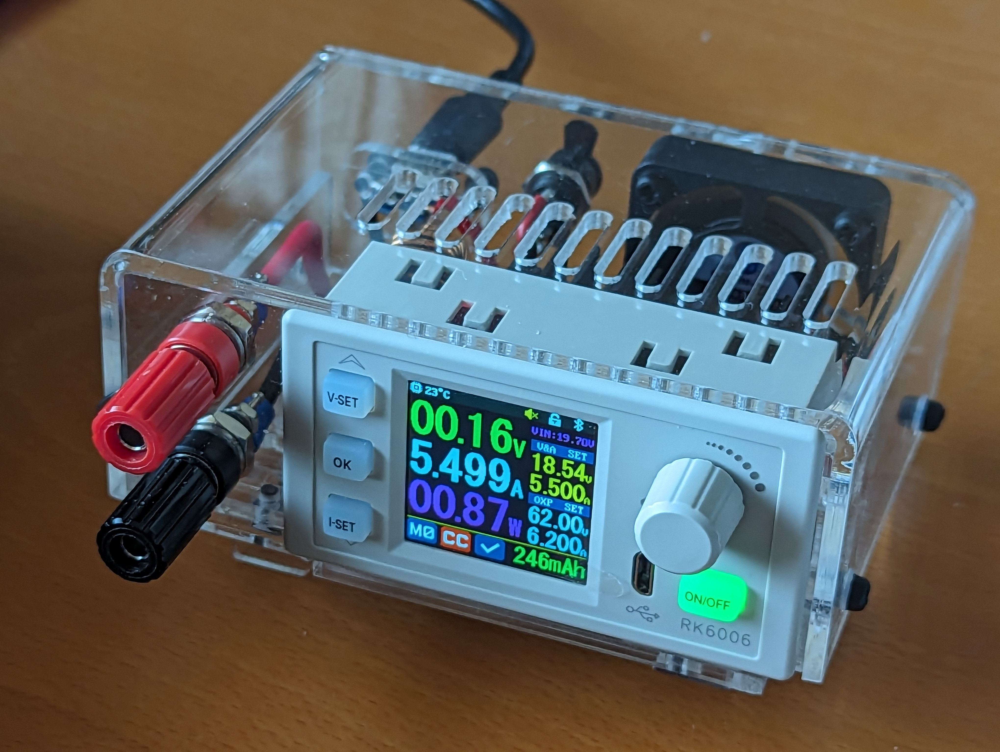

# USB-C powered RK6006 enclosure

Design using RealThunders [Link Branch Release] of FreeCAD and the Sheetmetal workbench.

Note: this isn't compatible with the standard FreeCAD release.

Laser cutting file with 0.001mm line thicknesses: [rk6006 enclosure cuts pdf]

<!--
This doesn't render because of 0.001mm line thicknesses.
It also doesn't render as generated direct from FreeCAD export because of 100% line stroke thickness.
I haven't found a way to render PDF inline.

-->

## To-do

 1. The USB Module clip has been modified to secure its vertical position. The base unfold doesn't recalculate and needs to be regenerated to incorporate this.
 1. The USB module mount has been reworked. Ideally the usb-chock part should have a location lug through the back panel.
 1. Provide line bending tutorial.

[Link Branch Release]: https://github.com/realthunder/FreeCAD/releases
[rk6006 enclosure cuts pdf]: rk6006-enclosure-cuts.pdf
