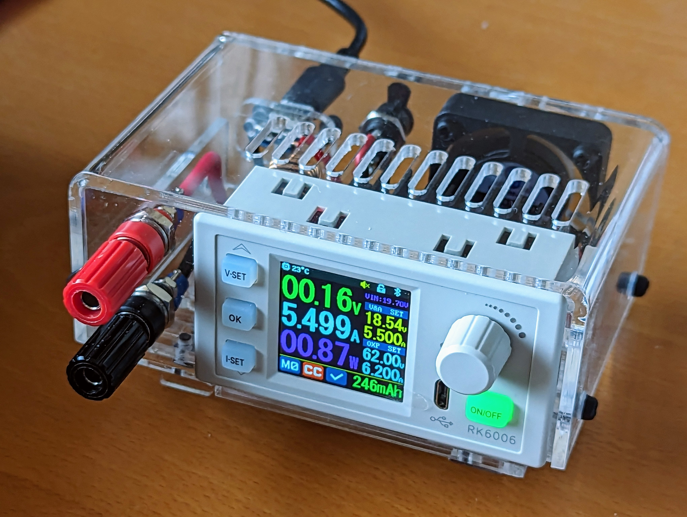

# USB-C powered RK6006-module enclosure

Design using RealThunders [Link Branch Release] of FreeCAD and the Sheetmetal workbench.

Note: this isn't compatible with the standard FreeCAD release.

Laser cutting file with 0.001mm line thicknesses: [rk6006 enclosure cuts pdf]. This can be cut from a single piece of 300x200mm cast-acrylic (Perspex®).

## Assembled unit

This is the fully assembled unit powered-up. Note there is a short across the output terminals.

<!--
This doesn't render because of 0.001mm line thicknesses.
It also doesn't render as generated direct from FreeCAD export because of 100% line stroke thickness.
I haven't found a way to render PDF inline.

-->

## Components
1. Red + Black 4mm Binding Post 10A

1. Red + Black 4mm Binding Post 10A
1. RIDEN® RK6006/RK6006-BT 60V 6A Power Supply Buck Converter
1. USB-C PD3.1 Decoy Module
1. Perspex 300x200mm
1. DC 5V 2Pin Cooling Fan 40x40x10mm
1. 12 x M3 Coarse (0.5mm) 15mm black nylon pan-head screws
1. 4 x M3 nylon washers - optional for the lid screws
1. USB-C 67W PD power adaptor - optional
1. Taper tap - M3 Coarse (0.5mm) - Required to cut the screw threads in the acrylic holes

For component details and suppliers see the [BOM]

## To-do

 1. Add all the details to this page.
 1. The USB Module clip has been modified to secure its vertical position. The base unfold doesn't recalculate and needs to be regenerated to incorporate this.
 1. The USB module mount has been reworked. Ideally the usb-chock part should have a location lug through the back panel.
 1. Provide details of the line bender and a line bending tutorial.

[Link Branch Release]: https://github.com/realthunder/FreeCAD/releases
[rk6006 enclosure cuts pdf]: rk6006-enclosure-cuts.pdf
[BOM]: https://docs.google.com/spreadsheets/d/1T6NbnWi5dBHlQWhf0BndDVR0SKQtk_TcdFyvAGypmZ0/edit?usp=sharing

